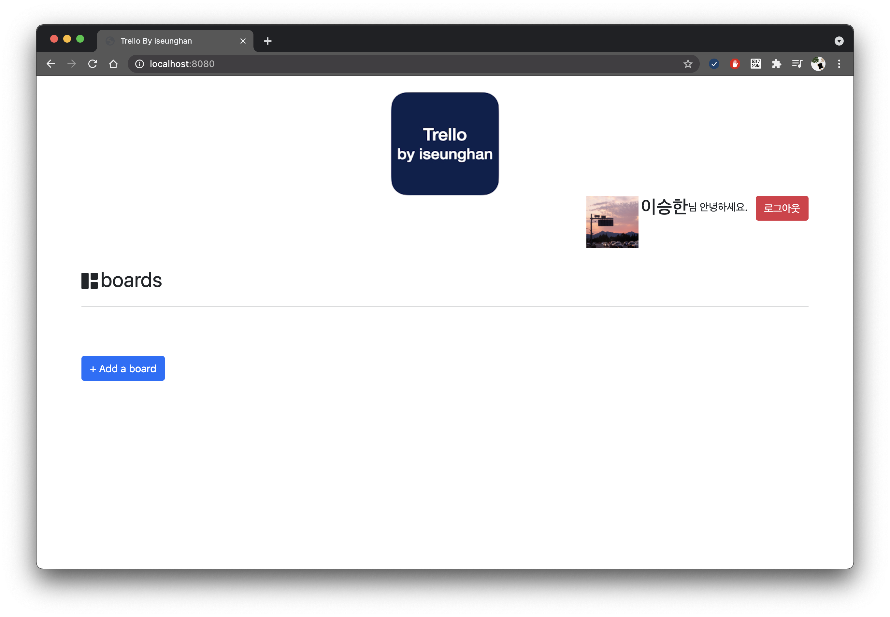
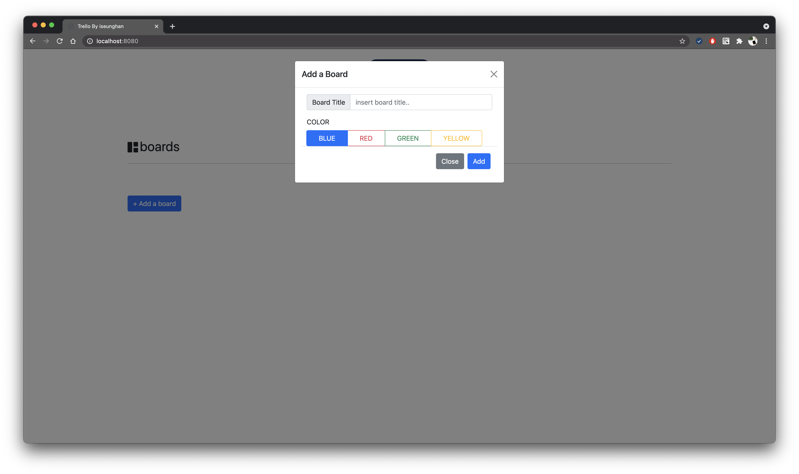
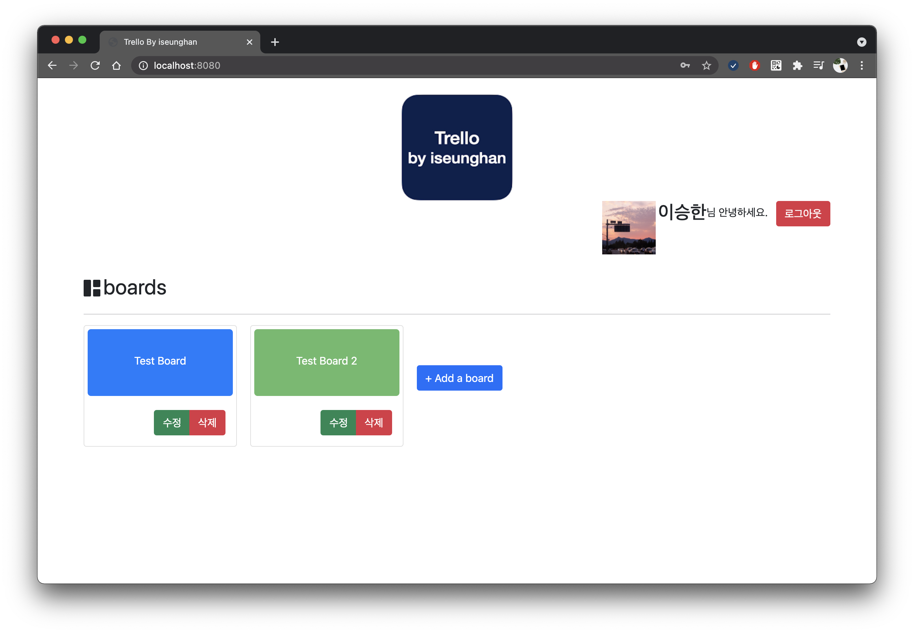
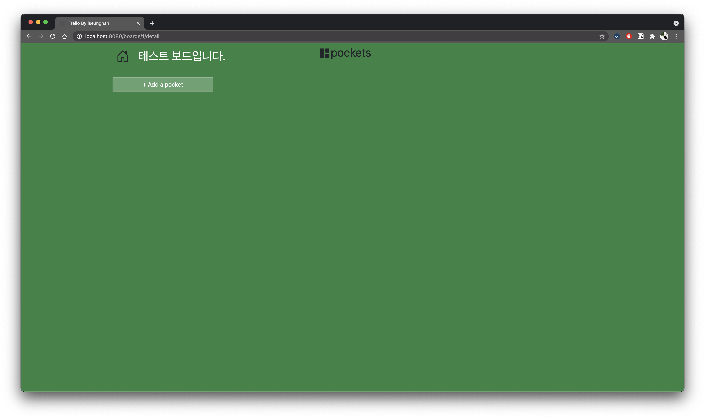
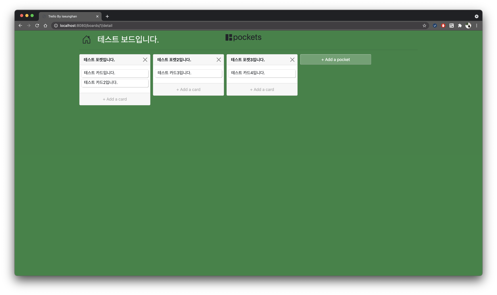
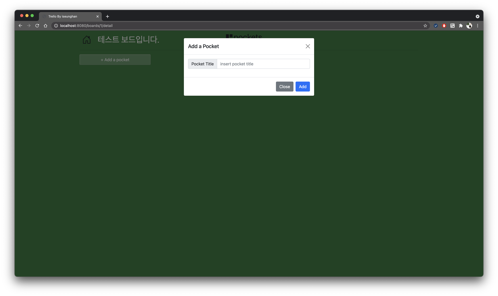
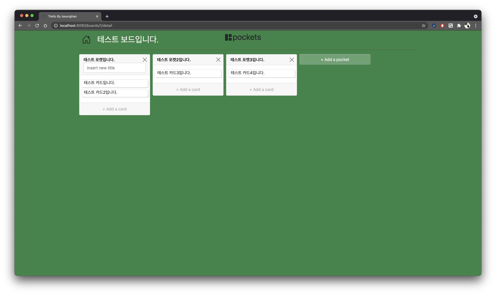
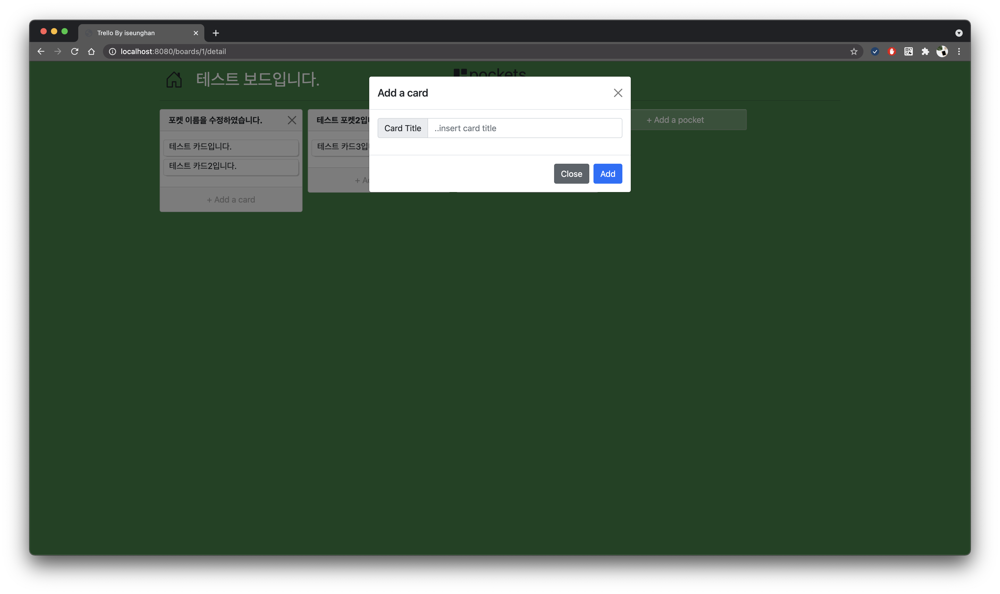
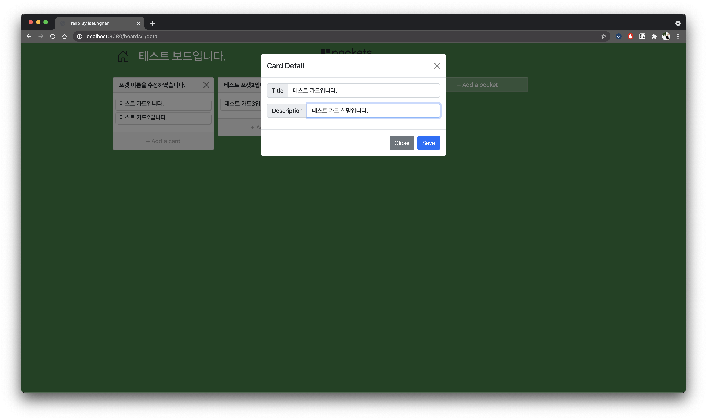
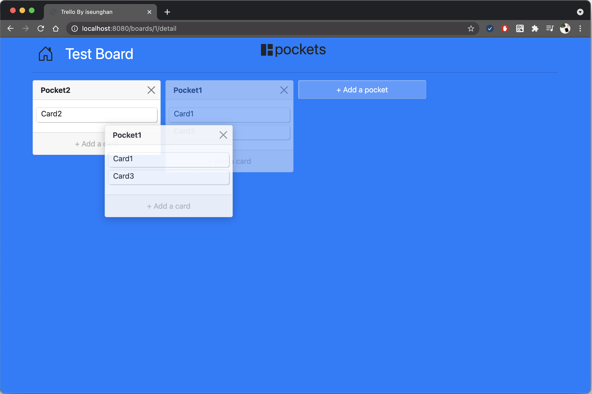

# 🌻 SpringMVC를 활용한 Trello 만들기
`Spring Boot`, `Spring Data JPA`, `h2 database`, `Thymeleaf`, `Mustache`

# 실행화면

---
- 소셜 로그인 페이지
- 메인 화면(로그인 완료 시)
- 보드 추가 모달 창
- 보드가 추가된 메인화면
- 보드 상세보기 화면 
    - 포켓과 카드가 추가된 화면
    - 포켓 추가 모달 창
    - 포켓 타이틀 변경
    - 카드 추가 모달 창
    - 카드 상세보기 모달 창 
- 드래그 앤 드롭

### 소셜 로그인 페이지

---

- OAuth2 인증을 이용해서 Google, Naver, Kakao 소셜 로그인 기능을 구현했습니다.

### 메인 화면(로그인 완료 시)

---

- 로그인을 완료 시, 해당 유저의 board를 보여줍니다. 

### 보드 추가 모달 창

---
* 보드의 `타이틀`과 `배경 색상`을 지정할 수 있습니다.

 
### 보드가 추가된 메인화면

---
* `수정` 버튼을 클릭하여 보드의 타이틀, 색상을 변경할 수 있고, `삭제` 버튼으로 삭제할 수 있습니다.

  
### 보드 상세보기 화면

---

### 포켓과 카드가 추가된 화면

---

### 포켓 추가 모달 창

---

### 포켓 타이틀 변경

---

### 카드 추가 모달 창

---

### 카드 상세보기 모달 창

---

### 드래그 앤 드롭 기능

---
* 포켓과 카드를 `드래그 앤 드롭`하여 위치를 옮길 수 있습니다.
